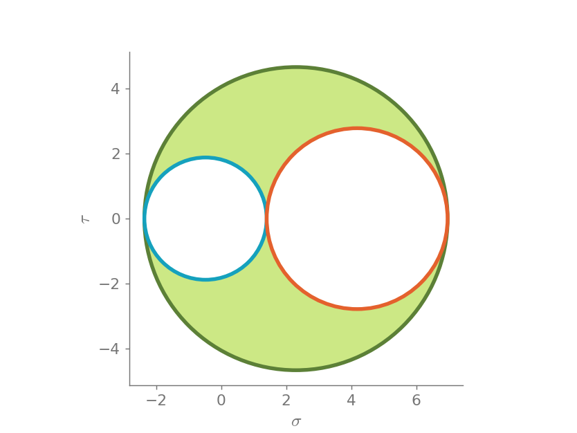

# Summary

`continuum_mechanics` is a Python package built on top of SymPy (@sympy) to aid
with calculations in Continuum Mechanics that are commonly lengthy and
tedious if done by hand. It also provides visualization capabilities for
second-order tensors such as Mohr's circle to help in stress analyses.

The package can be used by:

- researchers that need to double-check analytic calculations;

- researchers implementing numerical methods, such as the Finite element
  Method, that need to verify the solutions using techniques such as
  the Method of Manufactured Solutions (@roache2001, @aycock2020);

- analysts that need to _calibrate_ computational models related
  structural analysis in Civil or Mechanical Engineering;

- teachers who want to automate the creation of problem sets with
  solutions;

- students who want to verify their solutions to problem sets.

The `continuum_mechanics` package is ready for installation using `pip`
or can be tested online using the provided
[Jupyter Notebooks](https://mybinder.org/v2/gh/nicoguaro/continuum_mechanics/master).

# Statement of Need

`continuum_mechanics` was designed to be used by researchers and instructors
in the field of Continuum Mechanics. The package helps with tedious calculations
such as vector identities or the application of differential operators to
scalar, vector or tensor fields.

Some features of ``continuum_mechanics`` are:

- It is based on an open-source environment.

- It is easy to use.

- It provides the following curvilinear (orthogonal) coordinate systems:

  - Cartesian;

  - Cylindrical;

  - Spherical;

  - Parabolic cylindrical;

  - Parabolic;

  - Paraboloidal;

  - Elliptic cylindrical;

  - Oblate spheroidal;

  - Prolate spheroidal;

  - Ellipsoidal;

  - Bipolar cylindrical;

  - Toroidal;

  - Bispherical; and

  - Conical.

- It supports major vector operators such as:

  - gradient of a scalar function;

  - divergence of a vector function;

  - curl of a vector function;

  - gradient of a vector function;

  - divergence of a tensor;

  - Laplace operator of a scalar function;

  - Laplace operator of a vector function; and

  - Biharmonic operator of a scalar function.

# Examples of use

## Gradient of a scalar function

By default Cartesian coordinates are given by $x$, $y$ and $z$.
If these coordinates are used there is not necessary to specify
them when calling the vector operators

```python
from sympy import *
from continuum_mechanics import vector
x, y, z = symbols("x y z")
```

The gradient takes as input a scalar and returns a vector,
represented by a 3 by 1 matrix.

```python
f = 2*x + 3*y**2 - sin(z)
f
```

$$2x + 3y^2 - \sin(z)$$

```python
vector.grad(f)
```

$$\begin{bmatrix}2\\ 6y\\ -cos(z)\end{bmatrix}$$


## Visualization of a second-order symmetric tensor

The Mohr's circle is a two-dimensional graphical depiction of the
transformation law for the Cauchy stress tensor, where the abcissa represents
the normal stress component and the ordinate the shear stress component.
This representation is commonly used to represent stress states.

We can visualize

$$\begin{bmatrix}
1 &2 &4\\
2 &2 &1\\
4 &1 &3
\end{bmatrix}\, .$$

using the following snippet.

```python
from sympy import Matrix
from continuum_mechanics.visualization import mohr3d

mohr3d(Matrix([
    [1, 2, 4],
    [2, 2, 1],
    [4, 1, 3]]))
```

The Mohr circle for this tensor is presented in Figure 1.




# Recent Uses

The ``continuum_mechanics`` package was developed as a research aid in the
Applied Mechanics group at Universidad EAFIT, Colombia. Particularly, it has
been helpful during the development of Finite Element Methods for generalized
continua (@nowacki1986, @hadjesfandiari2011).  Some of the calculations
related to @guarin2020 are presented in one of the tutorials available
in the documentation.


# References
